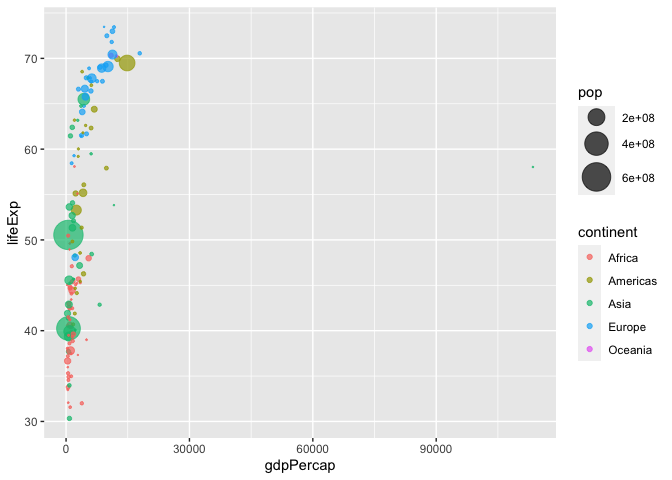

# Class 5 Data Visualization with ggplot2
Emily (PID: A15575724)

\##Using GGPLOT

The ggplot package needs to be installed as it does not come with R “out
of the box.”

We use the `install.packages()` function to do this.

``` r
head(cars)
```

      speed dist
    1     4    2
    2     4   10
    3     7    4
    4     7   22
    5     8   16
    6     9   10

To use ggplot I need to load it up before i can call any of the functons
in the package. I do this with the `library()` function

``` r
library(ggplot2)
ggplot()
```


All ggplot figures have at least 3 things: - data (the stuff we want to
plot) - aesthetic mapping (aes values) - geoms

``` r
ggplot(cars) + 
  aes(x=speed, y=dist) +
  geom_point() 
```


ggplot is not the only graphing system in R there are lots of others.
There is even “base R” graphics

``` r
plot(cars)
```


``` r
ggplot(cars) + 
  aes(x=speed, y=dist) +
  geom_point() + 
  labs(title= "Speed and Stopping Distances of Cars", 
       x="Speed (MPH)", 
       y= "Stopping Distance (ft)",
       subtitle = "Your informative subtitle text here", 
       caption = "Dataset: 'cars'") + 
  geom_smooth(method="lm",se=FALSE) + 
  theme_bw()
```

    `geom_smooth()` using formula = 'y ~ x'


``` r
url <- "https://bioboot.github.io/bimm143_S20/class-material/up_down_expression.txt"
genes <- read.delim(url)
head(genes)
```

            Gene Condition1 Condition2      State
    1      A4GNT -3.6808610 -3.4401355 unchanging
    2       AAAS  4.5479580  4.3864126 unchanging
    3      AASDH  3.7190695  3.4787276 unchanging
    4       AATF  5.0784720  5.0151916 unchanging
    5       AATK  0.4711421  0.5598642 unchanging
    6 AB015752.4 -3.6808610 -3.5921390 unchanging

``` r
nrow(genes)
```

    [1] 5196

``` r
colnames(genes)
```

    [1] "Gene"       "Condition1" "Condition2" "State"     

``` r
ncol(genes)
```

    [1] 4

``` r
table(genes$State)
```


          down unchanging         up 
            72       4997        127 

``` r
round(table(genes$State)/nrow(genes) *100, 2)
```


          down unchanging         up 
          1.39      96.17       2.44 

``` r
p <- ggplot(genes) +
  aes(x=Condition1, y=Condition2, col=State) +
  geom_point() 
```

``` r
p
```


``` r
p + scale_colour_manual( values=c("blue","gray","red") )
```


``` r
p + scale_colour_manual(values=c("blue","gray","red")) +
    labs(title="Gene Expresion Changes Upon Drug Treatment",
         x="Control (no drug) ",
         y="Drug Treatment")
```


``` r
#install.packages("gapminder)
library(gapminder)
```

``` r
#install.packages("dplyr")
```

``` r
# install.packages("dplyr")  ## un-comment to install if needed
library(dplyr)
```


    Attaching package: 'dplyr'

    The following objects are masked from 'package:stats':

        filter, lag

    The following objects are masked from 'package:base':

        intersect, setdiff, setequal, union

``` r
gapminder_2007 <- gapminder %>% filter(year==2007)
```

``` r
ggplot(gapminder_2007) +
  aes(x=gdpPercap,
      y=lifeExp,
      color=continent,
      size=pop) + 
  geom_point(alpha=0.5)
```


``` r
ggplot(gapminder_2007) +
  aes(x=gdpPercap,
      y=lifeExp,
      color=pop) + 
  geom_point(alpha=0.8)
```


``` r
ggplot(gapminder_2007) +
  aes(x=gdpPercap,
      y=lifeExp,
      size=pop) + 
  geom_point(alpha=0.5)
```


``` r
ggplot(gapminder_2007) + 
  geom_point(aes(x = gdpPercap, y = lifeExp,
                 size = pop), alpha=0.5) + 
  scale_size_area(max_size = 10)
```


``` r
gapminder_1957 <- gapminder %>% filter(year==1957)

ggplot(gapminder_1957) + 
  aes(x = gdpPercap, y = lifeExp, color=continent,
                 size = pop) +
  geom_point(alpha=0.7) + 
  scale_size_area(max_size = 10) 
```



``` r
gapminder_1957 <- gapminder %>% filter(year==1957 | year==2007)

ggplot(gapminder_1957) + 
  geom_point(aes(x = gdpPercap, y = lifeExp, color=continent,
                 size = pop), alpha=0.7) + 
  scale_size_area(max_size = 10) +
  facet_wrap(~year)
```


