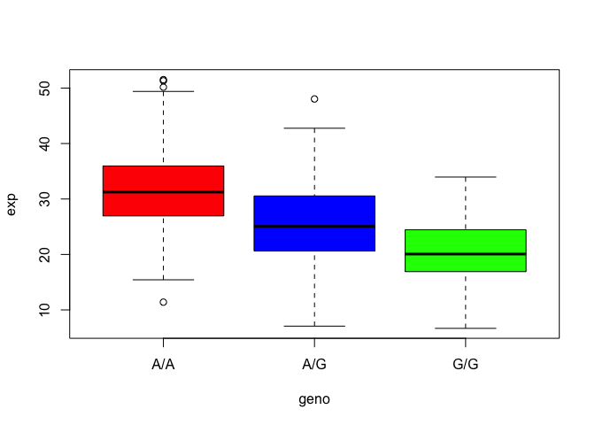

# Lab 12: Boxplot
Emily Hickey (A15575724)

``` r
expr <- read.table("rs8067378_ENSG00000172057.6.txt")
head(expr)
```

       sample geno      exp
    1 HG00367  A/G 28.96038
    2 NA20768  A/G 20.24449
    3 HG00361  A/A 31.32628
    4 HG00135  A/A 34.11169
    5 NA18870  G/G 18.25141
    6 NA11993  A/A 32.89721

``` r
summary(expr$sample)
```

       Length     Class      Mode 
          462 character character 

``` r
table(expr$geno)
```


    A/A A/G G/G 
    108 233 121 

``` r
colors = c(rep("red",1),rep("blue",1),rep("green",1))
boxplot(expr$exp ~ expr$geno, col= colors, xlab = "geno", ylab = "exp")
```


