# Class 19: Mini Project: Investigating Pertussis Resurgence
Emily Hickey (A15575724)

## Investigating pertussis cases by year

> Q1. With the help of the R “addin” package datapasta assign the CDC
> pertussis case number data to a data frame called cdc and use ggplot
> to make a plot of cases numbers over time.

``` r
library(datapasta)
```

``` r
cdc <- data.frame(
                          Year = c(1922L,
                                   1923L,1924L,1925L,1926L,1927L,1928L,
                                   1929L,1930L,1931L,1932L,1933L,1934L,1935L,
                                   1936L,1937L,1938L,1939L,1940L,1941L,
                                   1942L,1943L,1944L,1945L,1946L,1947L,1948L,
                                   1949L,1950L,1951L,1952L,1953L,1954L,
                                   1955L,1956L,1957L,1958L,1959L,1960L,
                                   1961L,1962L,1963L,1964L,1965L,1966L,1967L,
                                   1968L,1969L,1970L,1971L,1972L,1973L,
                                   1974L,1975L,1976L,1977L,1978L,1979L,1980L,
                                   1981L,1982L,1983L,1984L,1985L,1986L,
                                   1987L,1988L,1989L,1990L,1991L,1992L,1993L,
                                   1994L,1995L,1996L,1997L,1998L,1999L,
                                   2000L,2001L,2002L,2003L,2004L,2005L,
                                   2006L,2007L,2008L,2009L,2010L,2011L,2012L,
                                   2013L,2014L,2015L,2016L,2017L,2018L,
                                   2019L,2020L,2021L),
  No..Reported.Pertussis.Cases = c(107473,
                                   164191,165418,152003,202210,181411,
                                   161799,197371,166914,172559,215343,179135,
                                   265269,180518,147237,214652,227319,103188,
                                   183866,222202,191383,191890,109873,
                                   133792,109860,156517,74715,69479,120718,
                                   68687,45030,37129,60886,62786,31732,28295,
                                   32148,40005,14809,11468,17749,17135,
                                   13005,6799,7717,9718,4810,3285,4249,
                                   3036,3287,1759,2402,1738,1010,2177,2063,
                                   1623,1730,1248,1895,2463,2276,3589,
                                   4195,2823,3450,4157,4570,2719,4083,6586,
                                   4617,5137,7796,6564,7405,7298,7867,
                                   7580,9771,11647,25827,25616,15632,10454,
                                   13278,16858,27550,18719,48277,28639,
                                   32971,20762,17972,18975,15609,18617,6124,
                                   2116)
)
```

``` r
library(ggplot2)
```

``` r
ggplot(cdc) +
  aes(cdc$Year, cdc$No..Reported.Pertussis.Cases) +
  geom_point() +
  geom_line() +
  labs(title= "Pertussis Cases by Year(1922-2019)", x="Year", y="Number of cases")
```

    Warning: Use of `cdc$Year` is discouraged.
    ℹ Use `Year` instead.

    Warning: Use of `cdc$No..Reported.Pertussis.Cases` is discouraged.
    ℹ Use `No..Reported.Pertussis.Cases` instead.

    Warning: Use of `cdc$Year` is discouraged.
    ℹ Use `Year` instead.

    Warning: Use of `cdc$No..Reported.Pertussis.Cases` is discouraged.
    ℹ Use `No..Reported.Pertussis.Cases` instead.

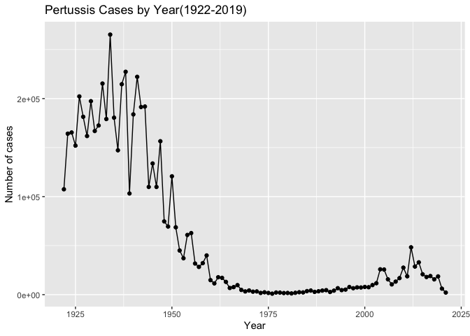

## A tale of two vaccines (wP & aP)

> Q2. Using the ggplot geom_vline() function add lines to your previous
> plot for the 1946 introduction of the wP vaccine and the 1996 switch
> to aP vaccine (see example in the hint below). What do you notice?

``` r
ggplot(cdc) +
  aes(cdc$Year, cdc$No..Reported.Pertussis.Cases) +
  geom_point() +
  geom_line() +
  geom_vline(xintercept=1946, linetype="dashed", color="blue") + 
  geom_vline(xintercept=1996, linetype="dashed", color="red") +
  geom_text(aes(label="wP"), x=1946, y=max(cdc$No..Reported.Pertussis.Cases), hjust=-0.5, color="blue") +
  geom_text(aes(label="aP"), x=1996, y=max(cdc$No..Reported.Pertussis.Cases), hjust=-0.5, color="red") +
  labs(title= "Pertussis Cases by Year(1922-2019)", x="Year", y="Number of cases")
```

    Warning: Use of `cdc$Year` is discouraged.
    ℹ Use `Year` instead.

    Warning: Use of `cdc$No..Reported.Pertussis.Cases` is discouraged.
    ℹ Use `No..Reported.Pertussis.Cases` instead.

    Warning: Use of `cdc$Year` is discouraged.
    ℹ Use `Year` instead.

    Warning: Use of `cdc$No..Reported.Pertussis.Cases` is discouraged.
    ℹ Use `No..Reported.Pertussis.Cases` instead.

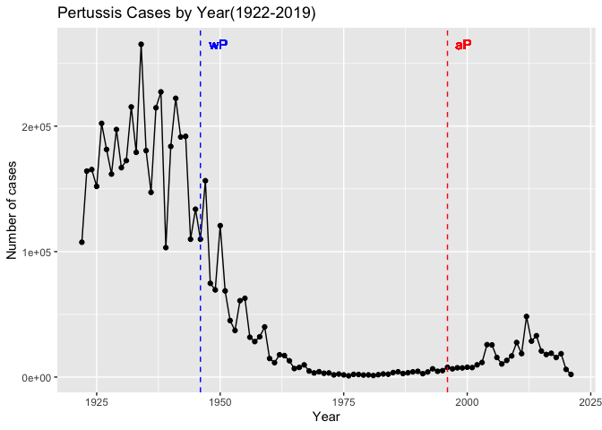

I notice that cases dropped after the wP vaccine was given but rose
again after the aP vaccine.

> Q3. Describe what happened after the introduction of the aP vaccine?
> Do you have a possible explanation for the observed trend?

After the introduction of the aP vaccine, there was a spike in pertussis
cases before cases began to drop again. Possible explanations for this
could be: better/more sensitive PCR tests, people being hesitant to the
new vaccine, bacterial evolution, and waning of immunity for those who
were given the newer aP vaccine as infants.

## Exploring CMI-PB data

``` r
library(jsonlite)
```

``` r
subject <- read_json("https://www.cmi-pb.org/api/subject", simplifyVector = TRUE) 
```

``` r
head(subject, 3)
```

      subject_id infancy_vac biological_sex              ethnicity  race
    1          1          wP         Female Not Hispanic or Latino White
    2          2          wP         Female Not Hispanic or Latino White
    3          3          wP         Female                Unknown White
      year_of_birth date_of_boost      dataset
    1    1986-01-01    2016-09-12 2020_dataset
    2    1968-01-01    2019-01-28 2020_dataset
    3    1983-01-01    2016-10-10 2020_dataset

> Q4. How many aP and wP infancy vaccinated subjects are in the dataset?

``` r
table(subject$infancy_vac)
```


    aP wP 
    60 58 

> Q5. How many Male and Female subjects/patients are in the dataset?

``` r
table(subject$biological_sex)
```


    Female   Male 
        79     39 

``` r
table(subject$biological_sex,subject$race)
```

            
             American Indian/Alaska Native Asian Black or African American
      Female                             0    21                         2
      Male                               1    11                         0
            
             More Than One Race Native Hawaiian or Other Pacific Islander
      Female                  9                                         1
      Male                    2                                         1
            
             Unknown or Not Reported White
      Female                      11    35
      Male                         4    20

## Working with dates

``` r
library(lubridate)
```


    Attaching package: 'lubridate'

    The following objects are masked from 'package:base':

        date, intersect, setdiff, union

``` r
today()
```

    [1] "2023-12-11"

How many days have passed since new year 2000?

``` r
today() - ymd("2000-01-01")
```

    Time difference of 8745 days

What is this in years?

``` r
time_length( today() - ymd("2000-01-01"),  "years")
```

    [1] 23.94251

> Q7. Using this approach determine (i) the average age of wP
> individuals, (ii) the average age of aP individuals; and (iii) are
> they significantly different?

``` r
# Use todays date to calculate age in days
subject$age <- today() - ymd(subject$year_of_birth)
subject$age
```

    Time differences in days
      [1] 13858 20433 14954 13128 12032 13128 15684 14223 10206 15319 13858 15319
     [13]  9840 11301 12762 13493 16050  9840 10936 15684 14954 14223 12032 11667
     [25] 13128 14954  9840 15319  9840 13128 12762  9840 12397 14954 12032  9840
     [37]  9475  9840 14223 10936 14223  9840  9475  9475  9840  9475 10206  9475
     [49]  9840  9840  9840  9475  9475  9840  9840  9840 10206  9840  9840  9840
     [61] 13493 11301 10571 11301 12397 17511 18972 18972 12397  9475  9475 12032
     [73] 10571 10571  9475  9475 13128 11301 13493 11667 11301  9475  9110  9840
     [85]  8745  9475  8745  8745  9840  9110  9475  8745 10206  9110  9475  8745
     [97] 13858 11301  9110  8379  7649  7649 10936 12762 10936 10206  9475 10571
    [109] 12762  9840 10206 10206 10206 12397  8014  8745 10936  9475

``` r
library(dplyr)
```


    Attaching package: 'dplyr'

    The following objects are masked from 'package:stats':

        filter, lag

    The following objects are masked from 'package:base':

        intersect, setdiff, setequal, union

``` r
ap <- subject %>% filter(infancy_vac == "aP")

round( summary( time_length( ap$age, "years" ) ) )
```

       Min. 1st Qu.  Median    Mean 3rd Qu.    Max. 
         21      26      26      26      27      30 

``` r
# wP
wp <- subject %>% filter(infancy_vac == "wP")
round( summary( time_length( wp$age, "years" ) ) )
```

       Min. 1st Qu.  Median    Mean 3rd Qu.    Max. 
         28      31      35      36      39      56 

> Q8. Determine the age of all individuals at time of boost?

``` r
int <- ymd(subject$date_of_boost) - ymd(subject$year_of_birth)
age_at_boost <- time_length(int, "year")
head(age_at_boost)
```

    [1] 30.69678 51.07461 33.77413 28.65982 25.65914 28.77481

> Q9. With the help of a faceted boxplot or histogram (see below), do
> you think these two groups are significantly different?

``` r
ggplot(subject) +
  aes(time_length(age, "year"),
      fill=as.factor(infancy_vac)) +
  geom_histogram(show.legend=FALSE) +
  facet_wrap(vars(infancy_vac), nrow=2) +
  xlab("Age in years")
```

    `stat_bin()` using `bins = 30`. Pick better value with `binwidth`.

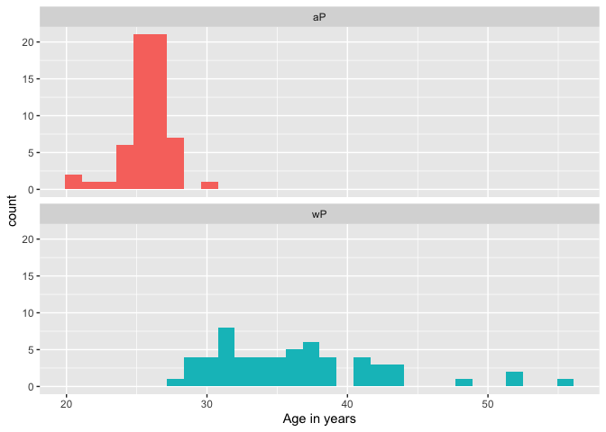

Yes, these two groups are significantly different

## Joining multiple tables

``` r
# Complete the API URLs...
specimen <- read_json("https://www.cmi-pb.org/api/specimen", simplifyVector = TRUE) 
titer <- read_json("https://www.cmi-pb.org/api/plasma_ab_titer", simplifyVector = TRUE) 
```

> Q9. Complete the code to join specimen and subject tables to make a
> new merged data frame containing all specimen records along with their
> associated subject details:

``` r
meta <- inner_join(specimen, subject)
```

    Joining with `by = join_by(subject_id)`

``` r
dim(meta)
```

    [1] 939  14

``` r
head(meta)
```

      specimen_id subject_id actual_day_relative_to_boost
    1           1          1                           -3
    2           2          1                            1
    3           3          1                            3
    4           4          1                            7
    5           5          1                           11
    6           6          1                           32
      planned_day_relative_to_boost specimen_type visit infancy_vac biological_sex
    1                             0         Blood     1          wP         Female
    2                             1         Blood     2          wP         Female
    3                             3         Blood     3          wP         Female
    4                             7         Blood     4          wP         Female
    5                            14         Blood     5          wP         Female
    6                            30         Blood     6          wP         Female
                   ethnicity  race year_of_birth date_of_boost      dataset
    1 Not Hispanic or Latino White    1986-01-01    2016-09-12 2020_dataset
    2 Not Hispanic or Latino White    1986-01-01    2016-09-12 2020_dataset
    3 Not Hispanic or Latino White    1986-01-01    2016-09-12 2020_dataset
    4 Not Hispanic or Latino White    1986-01-01    2016-09-12 2020_dataset
    5 Not Hispanic or Latino White    1986-01-01    2016-09-12 2020_dataset
    6 Not Hispanic or Latino White    1986-01-01    2016-09-12 2020_dataset
             age
    1 13858 days
    2 13858 days
    3 13858 days
    4 13858 days
    5 13858 days
    6 13858 days

> Q10. Now using the same procedure join meta with titer data so we can
> further analyze this data in terms of time of visit aP/wP, male/female
> etc.

``` r
abdata <- inner_join(titer, meta)
```

    Joining with `by = join_by(specimen_id)`

``` r
by=join_by(specimen_id)
dim(abdata)
```

    [1] 41810    21

> Q11. How many specimens (i.e. entries in abdata) do we have for each
> isotype?

``` r
table(abdata$isotype)
```


     IgE  IgG IgG1 IgG2 IgG3 IgG4 
    6698 3240 7968 7968 7968 7968 

> Q12. What are the different \$dataset values in abdata and what do you
> notice about the number of rows for the most “recent” dataset?

``` r
table(abdata$dataset)
```


    2020_dataset 2021_dataset 2022_dataset 
           31520         8085         2205 

The number of rows for the most “recent” data set are less than the
later data sets.

## Examine IgG Ab titer levels

``` r
igg <- abdata %>% filter(isotype == "IgG")
head(igg)
```

      specimen_id isotype is_antigen_specific antigen        MFI MFI_normalised
    1           1     IgG                TRUE      PT   68.56614       3.736992
    2           1     IgG                TRUE     PRN  332.12718       2.602350
    3           1     IgG                TRUE     FHA 1887.12263      34.050956
    4          19     IgG                TRUE      PT   20.11607       1.096366
    5          19     IgG                TRUE     PRN  976.67419       7.652635
    6          19     IgG                TRUE     FHA   60.76626       1.096457
       unit lower_limit_of_detection subject_id actual_day_relative_to_boost
    1 IU/ML                 0.530000          1                           -3
    2 IU/ML                 6.205949          1                           -3
    3 IU/ML                 4.679535          1                           -3
    4 IU/ML                 0.530000          3                           -3
    5 IU/ML                 6.205949          3                           -3
    6 IU/ML                 4.679535          3                           -3
      planned_day_relative_to_boost specimen_type visit infancy_vac biological_sex
    1                             0         Blood     1          wP         Female
    2                             0         Blood     1          wP         Female
    3                             0         Blood     1          wP         Female
    4                             0         Blood     1          wP         Female
    5                             0         Blood     1          wP         Female
    6                             0         Blood     1          wP         Female
                   ethnicity  race year_of_birth date_of_boost      dataset
    1 Not Hispanic or Latino White    1986-01-01    2016-09-12 2020_dataset
    2 Not Hispanic or Latino White    1986-01-01    2016-09-12 2020_dataset
    3 Not Hispanic or Latino White    1986-01-01    2016-09-12 2020_dataset
    4                Unknown White    1983-01-01    2016-10-10 2020_dataset
    5                Unknown White    1983-01-01    2016-10-10 2020_dataset
    6                Unknown White    1983-01-01    2016-10-10 2020_dataset
             age
    1 13858 days
    2 13858 days
    3 13858 days
    4 14954 days
    5 14954 days
    6 14954 days

> Q13. Complete the following code to make a summary boxplot of Ab titer
> levels (MFI) for all antigens:

``` r
ggplot(igg) +
  aes(MFI_normalised, antigen) +
  geom_boxplot() + 
    xlim(0,75) +
  facet_wrap(vars(visit), nrow=2)
```

    Warning: Removed 5 rows containing non-finite values (`stat_boxplot()`).


> Q14. What antigens show differences in the level of IgG antibody
> titers recognizing them over time? Why these and not others?

FIM2/3, PT, and FHA; website was not working, however my best guess
would be that it has to do with available tests for those specific
antibodies and the antibody properties such as specificity,
antigenicity, affinity, and antibody isotopes.

``` r
ggplot(igg) +
  aes(MFI_normalised, antigen, col=infancy_vac ) +
  geom_boxplot(show.legend = FALSE) + 
  facet_wrap(vars(visit), nrow=2) +
  xlim(0,75) +
  theme_bw()
```

    Warning: Removed 5 rows containing non-finite values (`stat_boxplot()`).

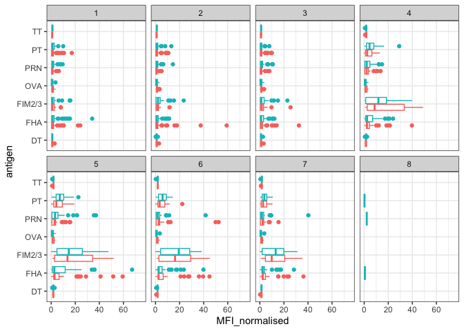

``` r
igg %>% filter(visit != 8) %>%
ggplot() +
  aes(MFI_normalised, antigen, col=infancy_vac ) +
  geom_boxplot(show.legend = FALSE) + 
  xlim(0,75) +
  facet_wrap(vars(infancy_vac, visit), nrow=2)
```

    Warning: Removed 5 rows containing non-finite values (`stat_boxplot()`).

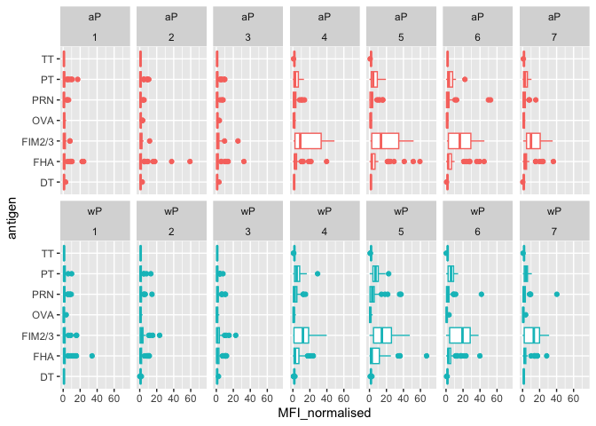

> Q15. Filter to pull out only two specific antigens for analysis and
> create a boxplot for each. You can chose any you like. Below I picked
> a “control” antigen (“OVA”, that is not in our vaccines) and a clear
> antigen of interest (“PT”, Pertussis Toxin, one of the key virulence
> factors produced by the bacterium B. pertussis).

``` r
filter(igg, antigen=="OVA") %>%
  ggplot() +
  aes(MFI_normalised, col=infancy_vac) +
  geom_boxplot(show.legend = TRUE) +
  facet_wrap(vars(visit)) +
  theme_bw()
```

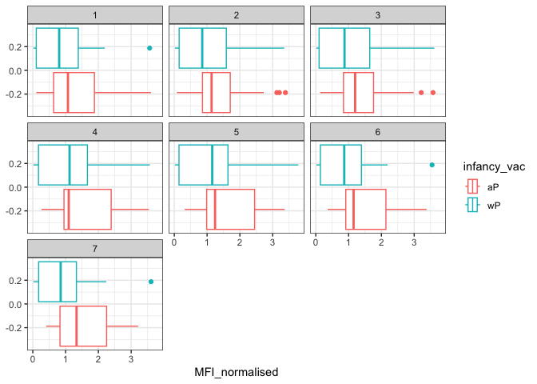

``` r
filter(igg, antigen=="FIM2/3") %>%
  ggplot() +
  aes(MFI_normalised, col=infancy_vac) +
  geom_boxplot(show.legend = TRUE) +
  facet_wrap(vars(visit)) +
  theme_bw()
```

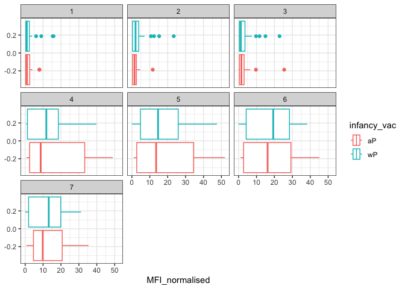

``` r
filter(igg, antigen=="PT") %>%
  ggplot() +
  aes(MFI_normalised, col=infancy_vac) +
  geom_boxplot(show.legend = TRUE) +
  facet_wrap(vars(visit)) +
  theme_bw()
```

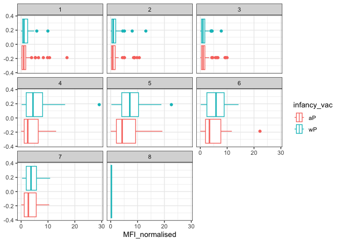

> Q16. What do you notice about these two antigens time courses and the
> PT data in particular?

PT antigen levels rise over time, significantly more than “OVA” and
“FIM2/3”,and peak around visit 5/6, then decrease. This happens to both
aP and wP subjects.

> Q17. Do you see any clear difference in aP vs. wP responses?

wP response is higher than aP.

``` r
abdata.21 <- abdata %>% filter(dataset == "2021_dataset")

abdata.21 %>% 
  filter(isotype == "IgG",  antigen == "PT") %>%
  ggplot() +
    aes(x=planned_day_relative_to_boost,
        y=MFI_normalised,
        col=infancy_vac,
        group=subject_id) +
    geom_point() +
    geom_line() +
    geom_vline(xintercept=0, linetype="dashed") +
    geom_vline(xintercept=14, linetype="dashed") +
  labs(title="2021 dataset IgG PT",
       subtitle = "Dashed lines indicate day 0 (pre-boost) and 14 (apparent peak levels)")
```

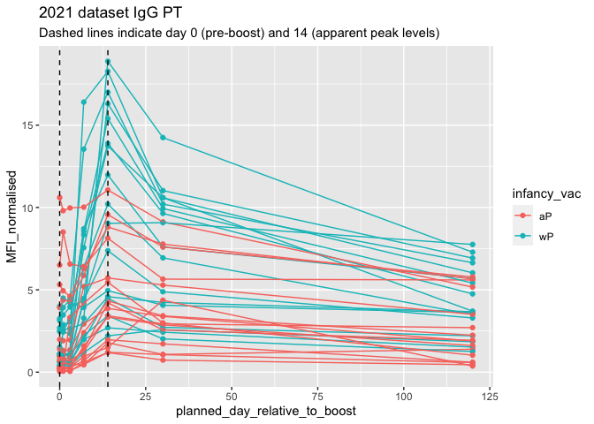

> Q18. Does this trend look similar for the 2020 dataset?

``` r
abdata.21 <- abdata %>% filter(dataset == "2020_dataset")

abdata.21 %>% 
  filter(isotype == "IgG",  antigen == "PT") %>%
  ggplot() +
    aes(x=planned_day_relative_to_boost,
        y=MFI_normalised,
        col=infancy_vac,
        group=subject_id) +
    geom_point() +
    geom_line() +
    geom_vline(xintercept=0, linetype="dashed") +
    geom_vline(xintercept=14, linetype="dashed") +
  labs(title="2021 dataset IgG PT",
       subtitle = "Dashed lines indicate day 0 (pre-boost) and 14 (apparent peak levels)")
```

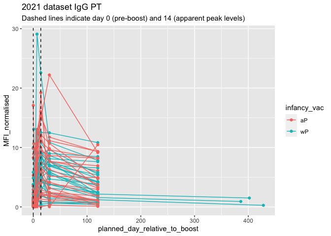

No, it does not look similar.

## Obtaining CMI-PB RNASeq data

``` r
url <- "https://www.cmi-pb.org/api/v2/rnaseq?versioned_ensembl_gene_id=eq.ENSG00000211896.7"

rna <- read_json(url, simplifyVector = TRUE) 
```

``` r
#meta <- inner_join(specimen, subject)
ssrna <- inner_join(rna, meta)
```

    Joining with `by = join_by(specimen_id)`

> Q19. Make a plot of the time course of gene expression for IGHG1 gene
> (i.e. a plot of visit vs. tpm).

``` r
ggplot(ssrna) +
  aes(visit, tpm, group=subject_id) +
  geom_point() +
  geom_line(alpha=0.2)
```

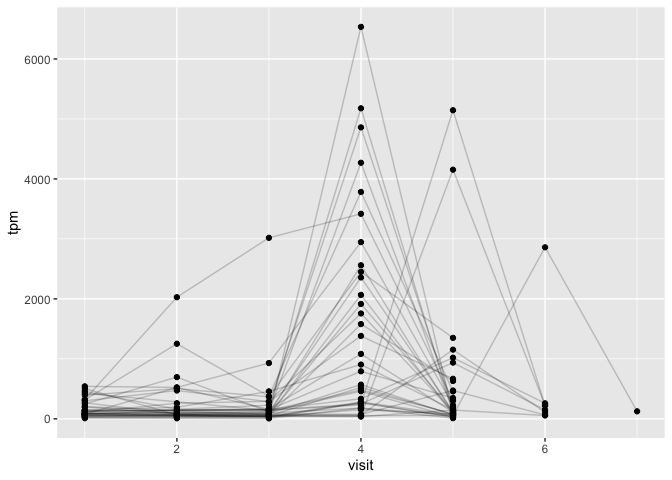

> Q20.: What do you notice about the expression of this gene (i.e. when
> is it at it’s maximum level)?

It is at its maximum level at visit 4.

> Q21. Does this pattern in time match the trend of antibody titer data?
> If not, why not?

No. The trend of antibody titer data reached a peak at visit 5, while
here is peaks at visit 4.

``` r
ggplot(ssrna) +
  aes(tpm, col=infancy_vac) +
  geom_boxplot() +
  facet_wrap(vars(visit))
```

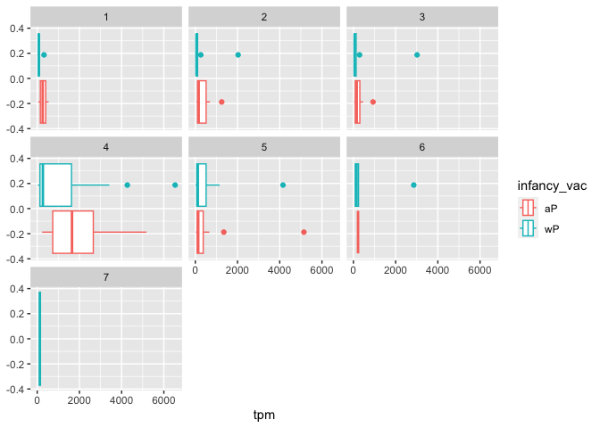

``` r
ssrna %>%  
  filter(visit==4) %>% 
  ggplot() +
    aes(tpm, col=infancy_vac) + geom_density() + 
    geom_rug() 
```

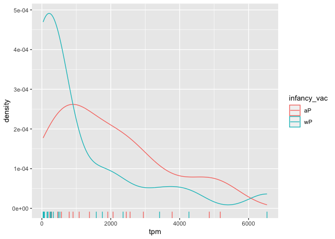
